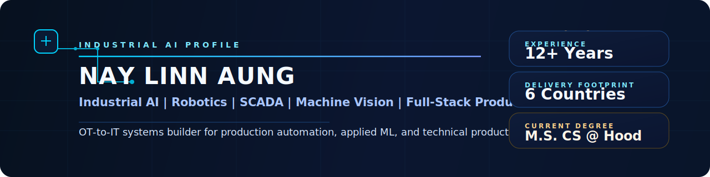

# Nay Linn Aung

Industrial AI and robotics engineer building production systems across PLC/SCADA, machine vision, explainable AI, and full-stack software delivery.

<!-- profile-readme-refresh: 2026-04-22 -->

  

## What I Build

I build production systems where PLC/SCADA, machine vision, robotics, and applied AI have to move beyond prototypes into software that can be deployed, operated, and trusted in real environments.

My background bridges plant-floor controls, OT networks, RTU/SCADA infrastructure, collaborative robotics, explainable AI, and full-stack delivery, allowing me to translate industrial complexity into deployable software.

## Selected Impact

- `12+ years` delivering automation, robotics, and industrial software systems.
- `6 countries` of engineering experience across Myanmar, Singapore, Malaysia, Indonesia, China, and the United States.
- `100+ RTU sites` architected for national-grid SCADA visibility with `99.9% system uptime`.
- `20+ collaborative robot machines` designed and delivered for semiconductor and manufacturing workflows.
- Publicly referenced work associated with `Foxconn`, `Honda`, `Dyson`, `Thermo Fisher Scientific`, `Infineon`, and `Coca-Cola`.

## Focus Areas

**OT / Industrial**

**AI / ML**

**Product**

## Featured Repositories

- **[naylinnaung.io](https://github.com/naylinnaungHoodedu/naylinnaung.io)**  
  Professional portfolio that unifies industrial automation, robotics, machine vision, and applied AI into a senior-engineer narrative.

- **[MicroSaaS-Factory](https://github.com/naylinnaungHoodedu/MicroSaaS-Factory)**  
  Full-stack operating system for market research, validation CRM, launch gating, and connected SaaS execution.

- **[AI_Portfolio_Project_Startup_Screener](https://github.com/naylinnaungHoodedu/AI_Portfolio_Project_Startup_Screener)**  
  AI-powered screening workspace for pitch decks, cohort workflows, and reviewer-ready venture analysis.

- **[qcai-studio](https://github.com/naylinnaungHoodedu/qcai-studio)**  
  Full-stack QC and AI learning platform built for structured curriculum, explainable concepts, and applied engineering labs.

- **[xai-industrial-automation](https://github.com/naylinnaungHoodedu/xai-industrial-automation)**  
  Explainable AI work focused on predictive maintenance and industrial automation decision support.

- **[videomae-activity-recognition](https://github.com/naylinnaungHoodedu/videomae-activity-recognition)**  
  VideoMAE activity recognition research covering ablation studies, resolution scaling, and temporal analysis on a 7-class HAR dataset.

## GitHub Snapshot

  

  

## Connect

- Email: [naylinnaung.234@gmail.com](mailto:naylinnaung.234@gmail.com)
- LinkedIn: [linkedin.com/in/naylinnaung](https://linkedin.com/in/naylinnaung/)
- Portfolio: [naylinnaung.io](https://naylinnaung.io)
- QCAI Studio: [qantumlearn.academy](https://qantumlearn.academy)
- Startup Screener: [startupscreener.io](https://startupscreener.io)
- MicroSaaS Factory: [microsaasfactory.io](https://microsaasfactory.io)
